**Grammar of graphics:** a language to be able to communicate about what we are plotting programatically
--------------------------------------------------------------------------------------------------------

The Grammar
===========

-   The *aesthetics* are what you can see. For example, the data being
    plotted or represented by a shape or colour. This data could be
    presented in multiple ways. Data is mapped to aesthetics. A plot can
    have multiple layers (for example, a scatterplot with a regression
    line).

-   Lines, bars, and points are examples of *geometric objects (geoms)*
    that could be used to present the data.

-   The data units need to be converted to physical units in order to be
    displayed. This uses *scaling* and a *coordinate system* (position
    adjustment for where is our pixel going). Other *statistical
    transformations* can also occur, such as aggregating data,
    jittering, density estimates, a boxplot and binning.

-   *Facetting* allows us to plot subsets of the data.

This grammar allows very specific control over your plot and the ability
to change features (easily). Plots can be scaled and made pretty enough
for publication quality images.

### Let's build a plot by adding these components one by one to see how this works.

I have tried to include some things which I used to end up googling ALL
THE TIME.

**Note: This dataset is fake - any resemblance to animals living or
otherwise is purely coincidental.**

    library(ggplot2)

    #Code for creating furry_dataset.csv in in the repo under furry_dataset.R
    fdat <- read.csv("furry_dataset.csv")

    #to start - we need our data - note that a blank graphic is produced - we have
    #not said what we are plotting or how we are plotting it
    ggplot(fdat)

    str(ggplot(fdat))

    ## List of 9
    ##  $ data       :'data.frame': 600 obs. of  9 variables:
    ##   ..$ name      : Factor w/ 600 levels "Abbey Jerde",..: 412 141 409 299 95 456 8 422 436 423 ...
    ##   ..$ color_name: Factor w/ 139 levels "AliceBlue","AntiqueWhite",..: 71 7 71 69 109 13 78 131 116 36 ...
    ##   ..$ latitude  : num [1:600] -25 -14.9 -54.4 11.6 -44.4 ...
    ##   ..$ longitude : num [1:600] 158.9 -127.1 -98.7 103.2 -161.8 ...
    ##   ..$ animal    : Factor w/ 6 levels "capybara","guinea pig",..: 3 5 1 2 6 4 3 5 1 2 ...
    ##   ..$ job       : Factor w/ 5 levels "customs officer",..: 3 2 2 3 1 1 1 1 3 1 ...
    ##   ..$ weight    : num [1:600] 339.99 9.84 159.4 0.93 27.39 ...
    ##   ..$ iq        : int [1:600] 45 19 49 49 84 29 75 21 44 20 ...
    ##   ..$ fitbit    : int [1:600] 10112 22 6239 1348 36364 4107 10576 19 5890 1575 ...
    ##  $ layers     : list()
    ##  $ scales     :Classes 'ScalesList', 'ggproto' <ggproto object: Class ScalesList>
    ##     add: function
    ##     clone: function
    ##     find: function
    ##     get_scales: function
    ##     has_scale: function
    ##     input: function
    ##     n: function
    ##     non_position_scales: function
    ##     scales: NULL
    ##     super:  <ggproto object: Class ScalesList> 
    ##  $ mapping    : list()
    ##  $ theme      : list()
    ##  $ coordinates:Classes 'CoordCartesian', 'Coord', 'ggproto' <ggproto object: Class CoordCartesian, Coord>
    ##     aspect: function
    ##     distance: function
    ##     expand: TRUE
    ##     is_linear: function
    ##     labels: function
    ##     limits: list
    ##     range: function
    ##     render_axis_h: function
    ##     render_axis_v: function
    ##     render_bg: function
    ##     render_fg: function
    ##     train: function
    ##     transform: function
    ##     super:  <ggproto object: Class CoordCartesian, Coord> 
    ##  $ facet      :Classes 'FacetNull', 'Facet', 'ggproto' <ggproto object: Class FacetNull, Facet>
    ##     compute_layout: function
    ##     draw_back: function
    ##     draw_front: function
    ##     draw_labels: function
    ##     draw_panels: function
    ##     finish_data: function
    ##     init_scales: function
    ##     map: function
    ##     map_data: function
    ##     params: list
    ##     render_back: function
    ##     render_front: function
    ##     render_panels: function
    ##     setup_data: function
    ##     setup_params: function
    ##     shrink: TRUE
    ##     train: function
    ##     train_positions: function
    ##     train_scales: function
    ##     vars: function
    ##     super:  <ggproto object: Class FacetNull, Facet> 
    ##  $ plot_env   :<environment: R_GlobalEnv> 
    ##  $ labels     : list()
    ##  - attr(*, "class")= chr [1:2] "gg" "ggplot"

    #list of 9 - data, layers, scales, mapping, theme, coordinates, facet, plot_env,
    #labels
    #luckily there are some defaults so we don't have to specify everything

    #in practice, people omit mapping = , but it might help you to understand what
    #we are doing
    #we are choosing the data we are plotting - the data can be scaled and the axes
    #appear
    ggplot(fdat, mapping = aes(x=weight, y=fitbit)) 

    #we have now chosen the geometric object to plot our data with
    ggplot(fdat, aes(x=weight, y=fitbit)) + geom_line() 

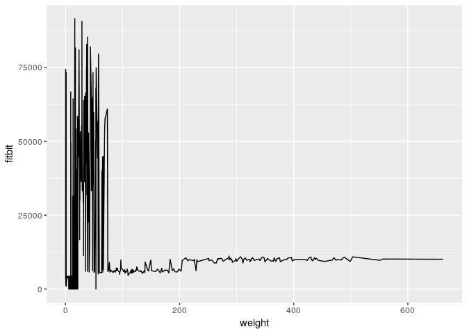

    #we can add a statistical transformation to look at the data on a different
    #scale
    ggplot(fdat, aes(x=weight, y=fitbit)) + 
        geom_line() + 
        scale_y_log10()

    #we can subset our data per animal by facetting
    ggplot(fdat, aes(x=weight, y=fitbit)) + 
        geom_line() + 
        scale_y_log10() + 
        facet_wrap(~animal)

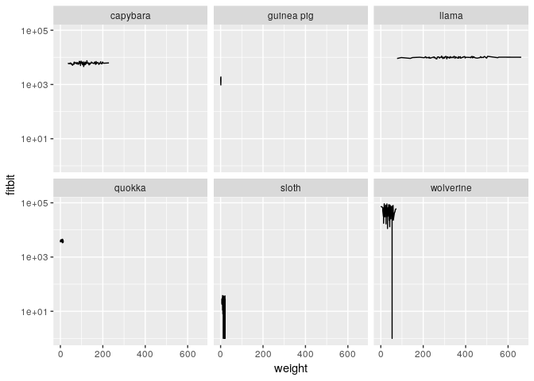

    #since the animals have quite a range of different weights, we could modify the
    #x-axis to be specific for each animal
    ggplot(fdat, aes(x=weight, y=fitbit)) + 
        geom_line() + 
        scale_y_log10() + 
        facet_wrap(~animal, scales="free_x")

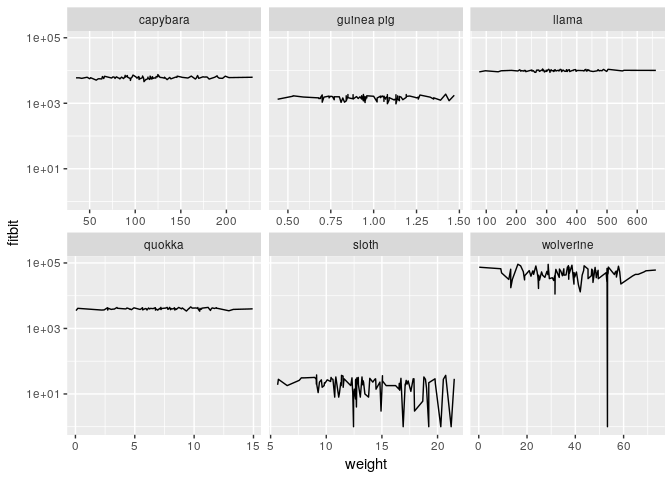

    #when we look at the data without the log transformation the wolverine is an
    #outlier. Wolverines are crazy, climb moutains, and being are tracked by
    #ultrarunners. They may be an outlier compared to our GP and sloth.
    ggplot(fdat, aes(x=weight, y=fitbit)) + 
        geom_line() + 
        facet_wrap(~animal, scales="free_x")

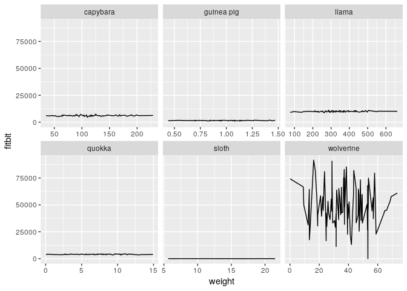

    #The data can be subsetted earlier, or in the function call. If you are using
    #the same mapping base frequently, you can store it as a variable to reduce
    #redundancy.
    p <- ggplot(subset(fdat, animal != "wolverine"), aes(x=weight, y=fitbit))

    p + geom_line() + 
        facet_wrap(~animal, scales="free_x")

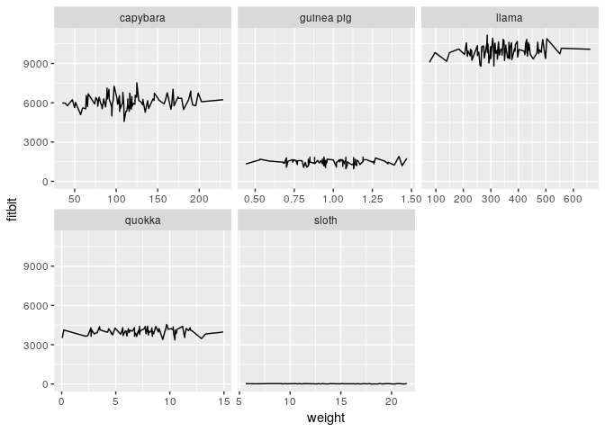

    #we could add a regression line - which is linear due to my use of a balanced
    #normal distribution. You can use other methods such as loess.
    p + geom_line() + 
      stat_smooth(method=lm) + 
        facet_wrap(~animal, scales="free_x")

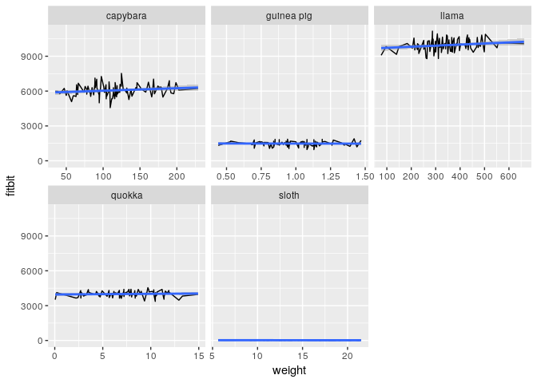

### Let's explore different types of plots, and learn how to customize and make things prettier.

    #scatterplot
    ggplot(fdat, aes(x=weight, y=iq, color=animal, shape=job)) + geom_point() 

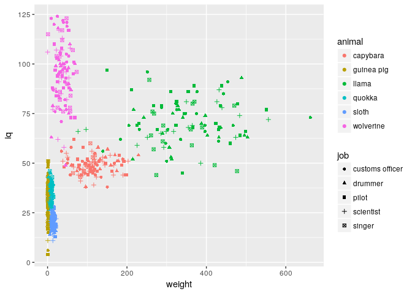

    #stripplot
    ggplot(fdat, aes(x=job, y=iq, color=animal, shape=job)) + geom_point() 

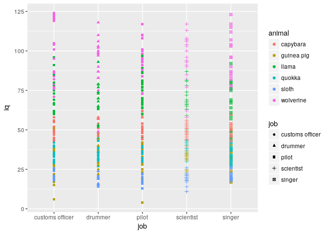

    #use jitter for overlapping data
    ggplot(fdat, aes(x=job, y=iq, color=animal)) + geom_jitter()

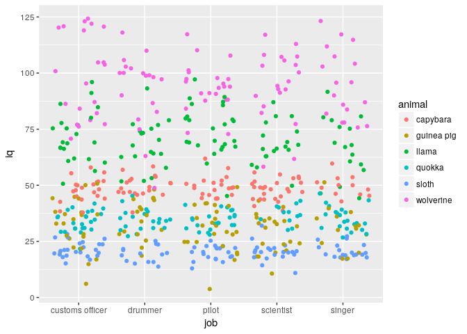

    #density
    #to customize aesthetics, we can color by a factor variable
    #alter transparency with alpha
    #change titles and axis labels
    #remove legends
    #change the defalut theme and tailor the current theme
    #specify colours manually
    ggplot(fdat, aes(x=iq, fill=animal, alpha=0.3)) + 
        geom_density() + 
        ggtitle("IQ of Furry Creatures") +
        xlab("Intelligence Quotient") +
    #   guides(fill=FALSE) +
        scale_alpha(guide="none") +
        theme_bw() +
        theme(title = element_text(face="bold", size=16), legend.title = element_blank(), legend.position = "left") +
        scale_fill_manual(values=c("purple", "cornflowerblue", "grey", "yellow", "orange", "brown"))

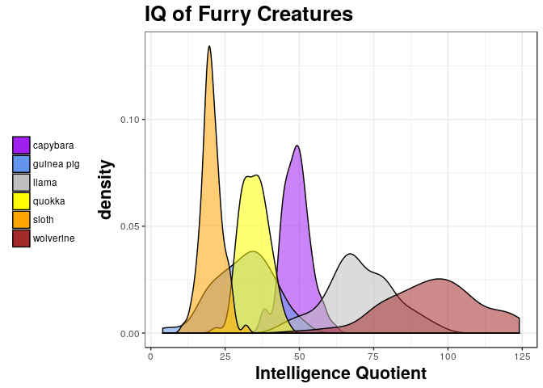

    #histogram
    #the default binwidth is 30 and has NOTHING to do with your data -- so CHANGE
    #IT!
    ggplot(fdat, aes(x=weight, fill=animal, alpha=0.3)) + 
        geom_histogram(binwidth = 50) 

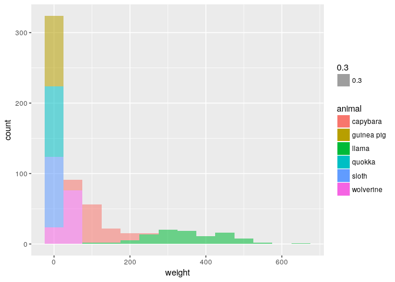

    #bar plot
    #this commented code throws an error - this is a common error so I included it.
    #ggplot(fdat, aes(x=animal, y=weight, fill=job)) + 
    #   geom_bar() 

    #need to specify identity - this is a stacked bar graph
    ggplot(fdat, aes(x=animal, y=weight, fill=job)) + 
        geom_bar(stat="identity") 

    #to position bars side-by-side instead
    #and to rotate x-axis labels to be vertical
    #try a different theme
    ggplot(fdat, aes(x=job, y=iq, fill=animal)) + 
        geom_bar(stat="identity", position="dodge") +
        theme_classic() +
        theme(axis.text.x=element_text(angle=90)) 

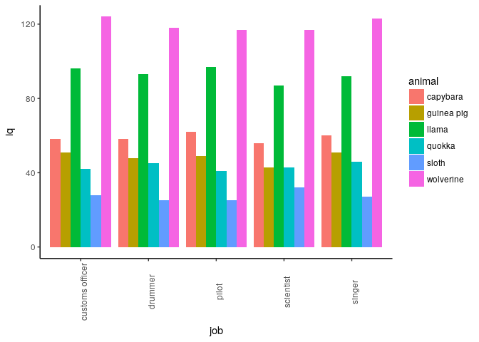

    #to flip the alignment
    ggplot(fdat, aes(x=job, y=iq, fill=animal)) + 
        geom_bar(stat="identity", position="dodge") +
        theme_classic() +
        coord_flip()

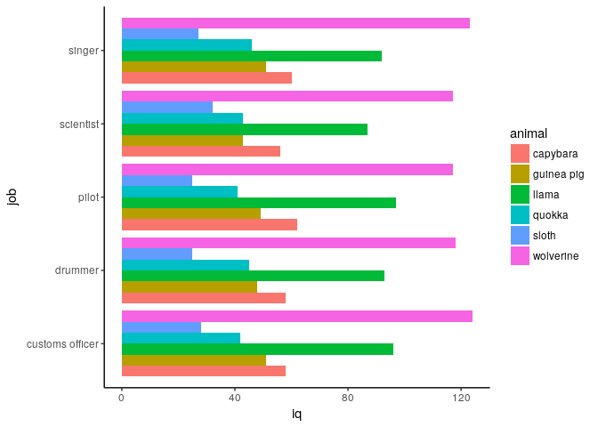

    #circular plots
    #the default coordinate system is cartesian coordinates
    #need to switch to polar coordinates to make a circle
    #note that this is a bar graph with polar coordinates - coxcomb plot
    #customize the major gridlines
    ggplot(fdat, aes(x=job, y=iq, fill=animal)) + 
        geom_bar(stat="identity", position="dodge") +
        coord_polar() +
        theme(panel.grid.major = element_line(color="cornflowerblue"))

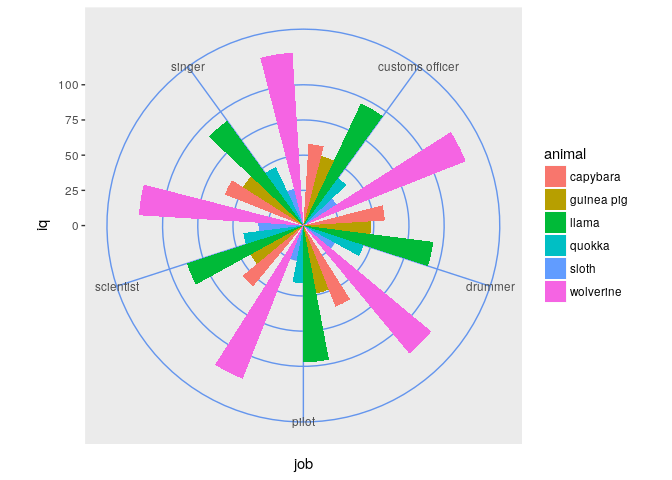

    #removing the dodge position gives back the stacked 'bar graph'
    ggplot(fdat, aes(x=job, y=iq, fill=animal)) + 
        geom_bar(stat="identity") +
        coord_polar() +
        theme(panel.grid.major = element_line(color="cornflowerblue"))

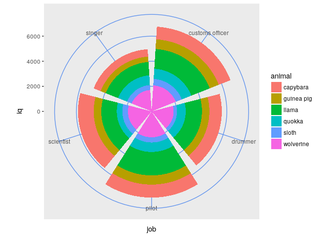

    #classic venn diagram, theta is the variable to map the angle
    #width = 1 wraps to a full circle
    ggplot(fdat, aes(x="", y=iq, fill=animal, alpha=0.1)) + 
        geom_bar(stat="identity", width=1) +
        coord_polar(theta="y") +
        theme(panel.grid.major = element_line(color="cornflowerblue")) 

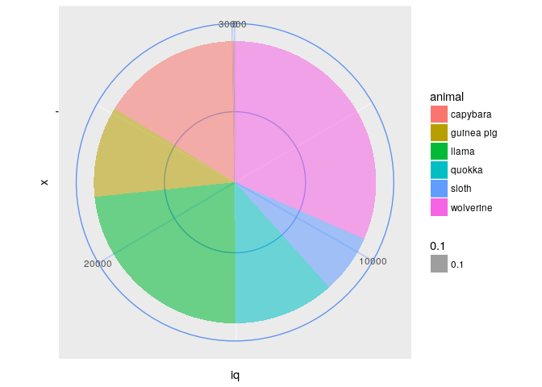

    #bullseye
    ggplot(fdat, aes(x="", y=iq, fill=animal, alpha=0.1)) + 
        geom_bar(stat="identity", width=1) +
        coord_polar(theta="x") +
        theme(panel.grid.major = element_line(color="cornflowerblue")) 

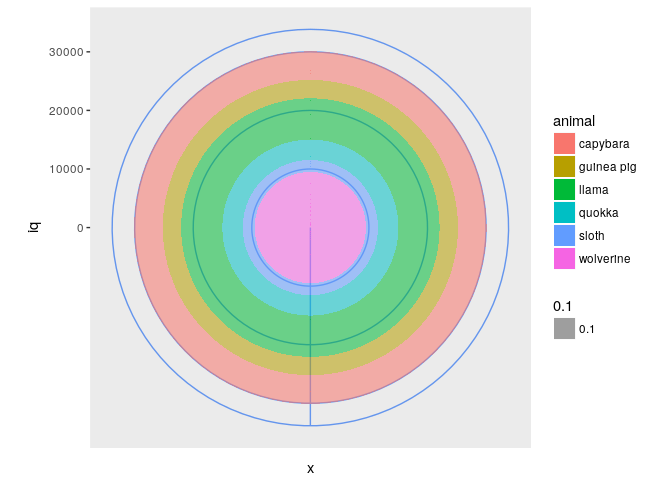

    #bubble plots
    ggplot(fdat,aes(x = animal, y = fitbit, fill=animal)) +
      scale_y_log10(limits=c(1,1000000)) +
      geom_jitter(aes(size = sqrt(fitbit/pi)), pch = 21, show.legend = FALSE) + 
      scale_size_continuous(range=c(1,30)) +
      facet_wrap(~ animal) +
      theme_dark() + 
      xlab(NULL) + 
      theme(axis.text.x = element_blank(), axis.ticks.x = element_blank())

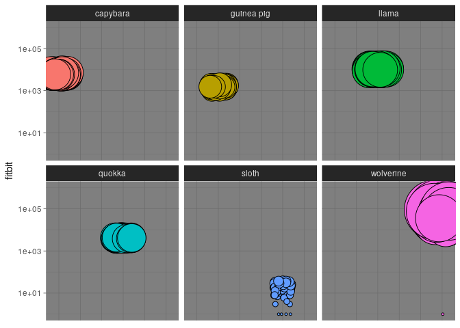

Further resources:
------------------

Reading: Wickham, Hadley. (2010). A Layered Grammar of Graphics. Journal
of Computational and Statistical Graphics.

Reading: Wilkinson, L. (2005), The Grammar of Graphics (2nd ed.).
Statistics and Computing, New York: Springer. \[14,18\]

Resource: <http://www.cookbook-r.com/Graphs/>

Tutorial: <https://github.com/jennybc/ggplot2-tutorial>

Reading: Tufte, Edward R. The Visual Display of Quantitative
Information.

Tutorial: <http://stcorp.nl/R_course/tutorial_ggplot2.html>

Resource: <http://ggplot2.tidyverse.org/reference/theme.html>
